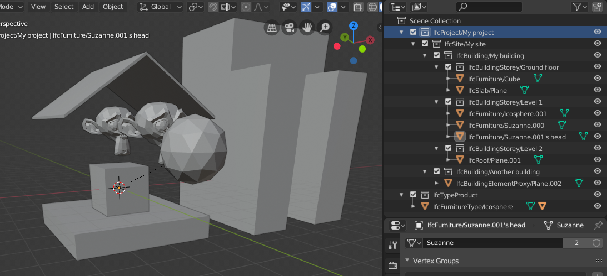
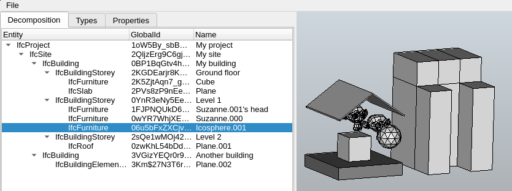

# Blender BIM IFC

_Under heavy development!_

Let's use Blender to create BIM models, because why not?

## Features

 - IFC4 is a first-class citizen. IFC4 has been an ISO standard since 2013, with
   the latest published in 2018. It contains many more features than IFC2X3,
   published back in 2005.
 - Use open-source Blender 2.8 to do digital modeling! Used by NASA, Hollywood,
   and Ubisoft, Blender allows real-time modeling in rendered view, animations,
   file linking, proxy objects, Blender Cloud collaboration, lighting analysis,
   CFD, energy modeling, and a huge ecosystem of add-ons with a thriving
   community. No licensing, and with a strong Python API to integrate into your
   custom workflow.
 - Create complex spatial structures with multiple sites, buildings, facilities,
   bridges, and building parts. Sites can be broken down into sub-sites and
   multiple buildings per site. You can categorise different floors to different
   buildings.
 - Classify any geometry as any IFC type. Just because it is a wall doesn't
   mean you should be limited to modeling it in a certain way. Easily change
   from one type to another, switch relationships and aggregations, reuse or
   even remove geometry altogether, without damaging your geometry or breaking
   your BIM model.
 - Use collections to create element compositions and decompositions with full
   control over the classifications of their parts. Most BIM programs don't give
   this flexibility. Create collection instances to efficiently duplicate
   composite objects.
 - Allow BIM objects to instance a shared geometric representations. This allows
   you to place the same shape in multiple objects without drastically
   increasing your filesize.
 - Provide a custom value to any simple IFC attribute of an IFC product.
 - Create product types that regular IFC products can inherit attributes from.
 - Define your own property sets with control over exactly how the data in the
   property sets are stored using property set template definitions which you
   can download or create yourself. Property sets can apply to both types and
   objects, and object property sets can selectively override type property
   sets.
 - Applies array modifiers to create instances.
 - Basic quantity take-off support for costing.
 - Settings to toggle export of quantities or geometric representations.
   Exporting IFC data without geometric representations is much faster and a
   fraction of the filesize.
 - Maintain `GlobalId` between exports, so that you can manipulate the IFC
   reliably in other software while making changes.
 - Not all objects need full solid geometry. Create representations as 2D or 3D
   curves / wireframes for rapid and lightweight BIM development.
 - Create map conversions and coordinate reference system definitions to link
   BIM to GIS.
 - Export basic materials with surface and diffuse colours for representation.
   You can also link materials to an externally defined file, such as a `.blend`
   Cycles material, V-Ray material, or even Radiance material for lighting
   simulation.
 - Switch between different types of metric units when modeling.
 - Model multiple representations for different purposes for a single BIM
   object or type, such as footprints, axis, reference, or clearance geometry.
   You can export just the type of representation required for your usecase, or
   export multiple for the user to choose from.
 - Record qualitative objectives such as design intentions, health and safety
   strategies, or code compliance, performance solutions, and more, in the BIM
   model and directly associate them to objects or types.
 - Classify objects and types to different classification systems such as
   Uniclass, Omniclass, or your custom system.
 - Associate external document files such as plans, brochures, specifications,
   warranties, or anything to objects and types.

## Demo

It's only just started, so everything can and will change. But if you want to
check it out:

 1. Install [Blender](https://www.blender.org/).
 2. Install [IfcOpenShell](https://github.com/IfcOpenShell/IfcOpenShell),
    ensuring that is is compiled to the same Python version and architecture of
    your Blender installation.
 3. Launch Blender. Open `untitled.blend`. You should see the `export.py`
    script already loaded. Change the hardcoded paths from
    `/home/dion/Projects/blender-bim-ifc/` to wherever you've cloned this
    repository.
 4. Ensure `ifcopenshell` is in your Blender Python's path, so that it can
    `import ifcopenshell`. You can run
    `sys.path.append('/path/to/your/ifcopenshell/module')` in the Blender Python
    console to do this.
 5. Select all objects that you want to export. Press `Run Script`, and you will
    get the results in `output.ifc`.

A naming convention of `IfcClass/IfcName` is enforced. If you name your object
`IfcWall/Foo`, it will turn into an `IfcWall` with the name attribute set to
`Foo`. You can override object attributes using Blender's `Custom Properties`.
Your objects must live in a top level `Collection` defined as a context class,
usually something like `IfcProject/Foo`. You can then nest spatial structures
underneath to create a hierarchy.

... this Blender files creates this IFC file ...

